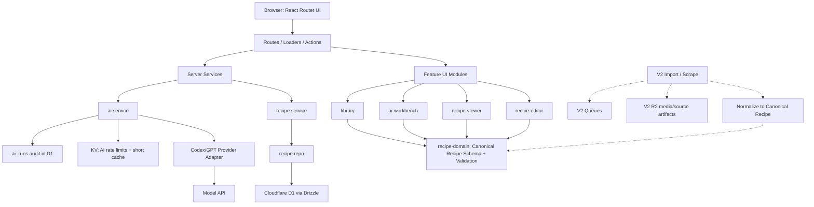

# ProjectSpice

ProjectSpice is being rebuilt as a small, modular, AI-native recipe workbench.
The V1 north star is a modern Paprika-style private app: clear recipe
management, pleasant structured editing, and Codex/GPT-assisted recipe creation
or transformation through reviewable drafts.

The active delivery plan lives at:

```text
/Users/hhan/workspaces/plans/active/project-spice-v1-modular-rebuild-plan.md
```

The previous full-featured app remains recoverable through git history. V1
should not reintroduce old imports, scraping, shopping lists, meal planning,
family sharing, public sharing, uploaded media pipelines, nutrition, pantry,
cooking logs, login, or complex AI provider routing unless a current V1 slice
explicitly asks for it.

## V1 Architecture



Routes own HTTP and React Router integration. Services own business rules.
Repositories own D1 details. Every recipe-shaped input and output validates
through `recipe-domain`.

## Module Map

```text
app/
  modules/
    recipe-domain/   canonical recipe types, Zod schemas, fixtures, formatters
    recipe-editor/   structured metadata, ingredient, and direction editing UI
    recipe-viewer/   Paprika-inspired desktop and mobile recipe reading layouts
    library/         recipe search, sorting, list/card UI, and create entry point
    ai-workbench/    generate/transform forms, draft previews, and accept flows
    ui-shell/        app frame, primitives, navigation, layout, and empty states
  server/
    db/              D1 client, Drizzle schema, and migrations
    recipes/         recipe repository and service
    ai/              prompt contracts, provider adapter, and AI service
  routes/            React Router routes, loaders, actions, and API endpoints
workers/
  app.ts             Cloudflare Worker request handler
```

This map is a delivery target, not a request to create empty folders. Slices
should add only the files needed for their current behavior.

## V1 Scope

V1 includes:

- Create, edit, save, view, and delete recipes.
- Store every recipe in one canonical schema.
- Structured ingredient sections/items and direction sections/steps.
- Optional recipe `imageUrl` strings for lightweight visual polish.
- AI generate and transform flows that validate output and remain reviewable
  drafts until explicitly saved.
- Single-user, private operation with no login.
- Cloudflare deployment for `spice.h6nk.dev`.

Deferred to later versions:

- Imports, scraping, uploaded media pipelines, R2-backed images, shopping lists,
  meal planning, family sharing, public sharing, nutrition, pantry, cooking
  logs, login/auth, and multi-provider AI routing.

## Local Commands

Install dependencies:

```bash
pnpm install
```

Start the development server:

```bash
pnpm dev
```

Open the app:

```text
http://127.0.0.1:5173/
```

Run verification:

```bash
pnpm test
pnpm lint
pnpm typecheck
pnpm build
```

Preview the production build locally:

```bash
pnpm preview
```

Generate Cloudflare binding types:

```bash
pnpm cf-typegen
```

## Deploy Commands

The current scaffold has Wrangler environments for development, staging, and
production, but D1/KV bindings are intentionally deferred until the persistence
and deployment slices add them.

Build before deploy:

```bash
pnpm build
```

Deploy staging:

```bash
pnpm wrangler deploy --env staging
```

Deploy production to `spice.h6nk.dev`:

```bash
pnpm wrangler deploy --env production
```

## Current Repository Layout

```text
app/
  app.css
  entry.server.tsx
  root.tsx
  routes.ts
  routes/home.tsx
workers/
  app.ts
```
